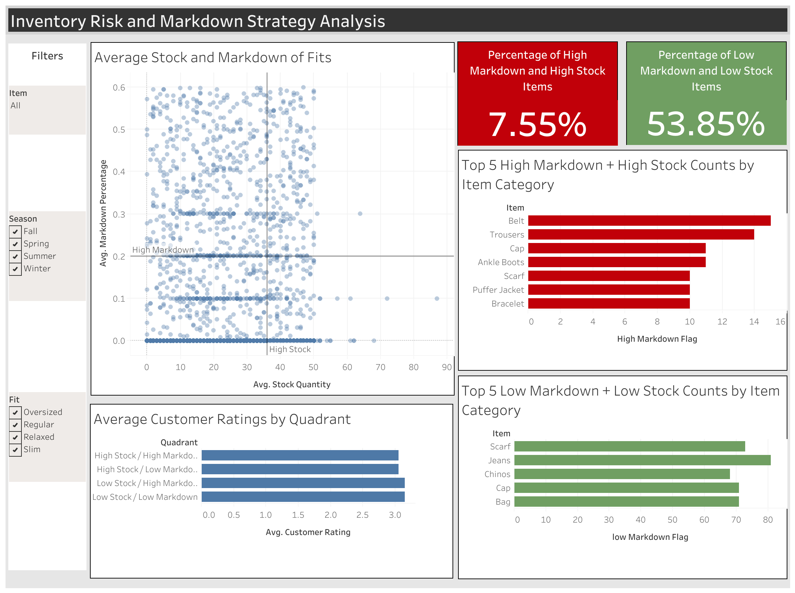

# Fashion Retail Data Analysis

### Project Overview:

This project investigates the relationship between inventory levels, markdown strategies, and customer satisfaction in fashion retail. The analysis identifies overstocked product segments, evaluates pricing responses across product attributes, and examines whether inventory misalignment impacts customer ratings and seasonal demand.

### Executive Summary
Across popular fashion brands around 7.5% of items received high markdown rates while having stock quantities simultaneously indicating concentrated areas of potential risks of overstocking. Furthermore, 53.85% of items received low markdown rates while having low stock quantities reflecting a largely conservative inventory allocation structure. Notably, items with high markdown activity do not receive particularly low customer ratings suggesting there is limited association between customer satisfaction and markdown rates within this dataset. Overall, the findings indicate that inventory exposure is limited but concentrated in specific segments, presenting targeted opportunities for stock reallocation and more optimized inventory positioning. Below is the overview of the tableau dashboard that summarizes these results:

